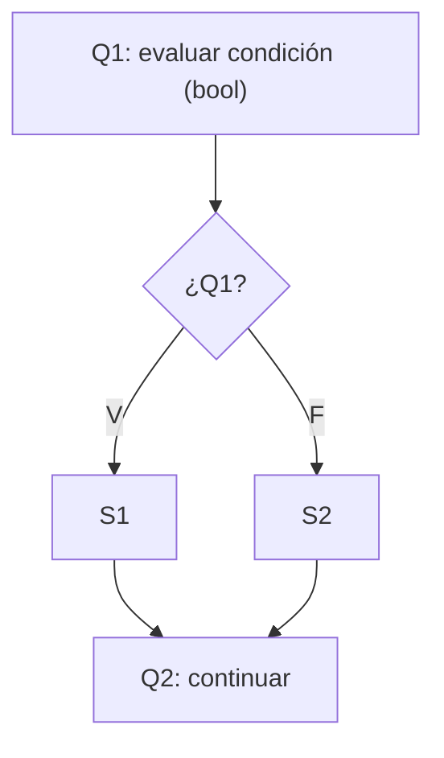
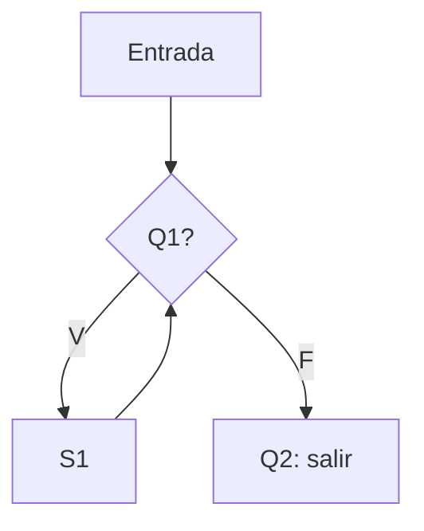
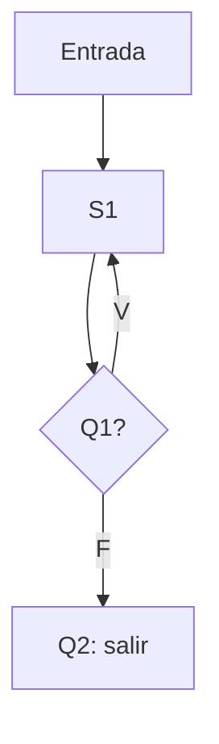
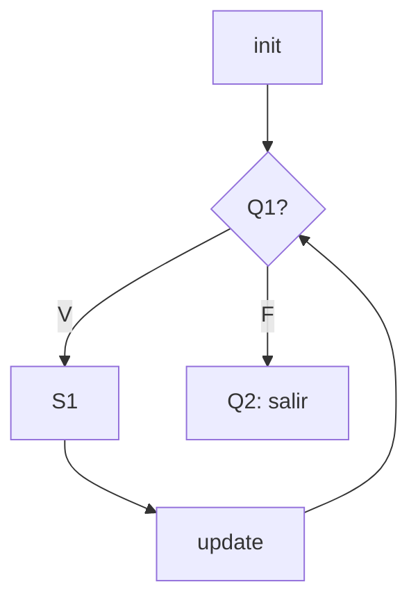

# Lógica Proposicional aplicada al Flujo de Control (if, while, do-while, for)

>
> | Símbolo | Significado propuesto |
> |---|---|
> | `Q1`, `Q2` | Variables proposicionales = **condiciones** booleanas (ej. `Q1 := (i < n)`). En PyScript: expresión de tipo `bool` en `if` / `while` / `for`. |
> | `S1`, `S2` | **Bloques / sentencias** que se ejecutan (`[S1]`, `[S2]`). |
> | `R1`, `R2` | **Resultados / estados** tras ejecutar (ej. `R2 := "programa continúa en Q2"`). |
> | `N` | **Negación** (`Q1 N` = `¬Q1` = `!Q1`). |
> | `->` | **Implicación material** (`Q1 -> R2` = `Q1 → R2` = `!Q1 || R2`). |
> | `v` | **Disyunción** (`v` = `∨` = `\|\|`). |
> | `V` / `F` | Valores **Verdadero / Falso**. |

---

## 2.- Diagramas de flujo para `if`, `while`, `do-while`, `for`

Esquema general pedido: `Q1` (condición), `V -> S1`, `F -> S2`, `Q2` (continuación).

### 2.1 `if / else`



Equivalente en PyScript:

```text
if (Q1) {
    S1
} else {
    S2
}
```

Sin `else`, `S2` es "no hacer nada" (rama vacía hacia `Q2`).

### 2.2 `while` (prueba previa: puede ejecutarse 0 veces)



Equivalente:

```text
while (Q1) {
    S1
}
```

### 2.3 `do-while` (prueba posterior: `S1` se ejecuta al menos 1 vez)



Equivalente:

```text
do {
    S1
} while (Q1);
```

Diferencia con `while`: el arco `Entrada -> S1` no pasa por `Q1`.

### 2.4 `for` (init + condición + update)



Equivalente:

```text
for (init; Q1; update) {
    S1
}
```

`Q1` ausente equivale a `Q1 = V` (ciclo infinito salvo `break`, fuera de alcance v0.1).

---

## 3.- Demostración (prueba por casos del `if / else`)

Premisas propuestas (léase `[S1] R2` como "tras ejecutar `S1` se alcanza `R2`"):

1. `Q1 → ([S1] R2)` — "Q1 si se cumple condición, entonces `[S1]` R2".
2. `¬Q1 → ([S2] R2)` — "Q1 no se cumple condición, entonces `[S2]` R2".

Tesis: el programa **siempre** alcanza `R2` por una de las dos ramas:

```text
(Q1 -> R2 vía [S1]) v (Q1 N -> R2 vía [S2])
```

Demostración por casos (tercero excluido, `Q1 v ¬Q1`):

| Paso | Justificación |
|---|---|
| 1. `Q1 v ¬Q1` | Tercero excluido (tautología). |
| 2. Supongo `Q1` | Caso V. |
| 3. `[S1] R2` | Por premisa 1 + modus ponens sobre 2. Rama `V -> S1` (ver recuadro). |
| 4. Supongo `¬Q1` | Caso F. |
| 5. `[S2] R2` | Por premisa 2 + modus ponens sobre 4. Rama `F -> S2`. |
| 6. En ambos casos se llega a `R2` | Eliminación de la disyunción. |

> **¿Qué es *modus ponens* y cómo se usa en el paso 3?**
>
> Es la regla de inferencia más básica: **si tienes `P → Q` y tienes `P`, puedes concluir `Q`**.
>
> ```text
> P → Q   (condicional)
> P       (afirmo el antecedente)
> ∴ Q     (concluyo el consecuente)
> ```
>
> En el paso 3, la instanciación es:
>
> ```text
> P := Q1                    (la condición es verdadera)
> Q := ([S1] R2)             (tras ejecutar S1 se alcanza R2)
> P → Q := premisa 1         (Q1 → ([S1] R2))
> P     := supuesto del paso 2 (estoy en el caso V)
> ∴ Q   := [S1] R2           (entro a la rama V -> S1 y llego a R2)
> ```
>
> Ejemplo concreto con código (sea `Q1 := (age >= 18)`, `S1 := print("Adult")`, `R2 := "continúo en Q2"`):
>
> ```text
> Si (age >= 18) entonces tras print("Adult") continúo.   (premisa 1)
> age >= 18 es verdadero.                                  (paso 2, caso V)
> ∴ ejecuto print("Adult") y continúo.                    (paso 3)
> ```
>
> El paso 5 es idéntico pero en la rama `F`: con `¬Q1` y la premisa 2 (`¬Q1 → ([S2] R2)`) concluyo `[S2] R2`.
> Por eso la fila dice "modus ponens **sobre** 2 (o 4)": el "sobre" indica contra qué supuesto descargo la implicación.

- "Q1 si cumple condición, entonces `[S1]`"
- "Q1 no cumple condición, sino `[S2]` R2"
- La `v` (ó) final es la unión de ambos casos en el paso 6: un `if/else` bien formado cubre las dos ramas y converge en `Q2/R2`.

---

## 4.- Tablas de verdad

### 4.1 `Q1 -> R2` (implicación material: solo es `F` con `V -> F`)

| Q1 | R2 | Q1 -> R2 |
|---|---|---|
| V | V | V |
| V | F | F |
| F | V | V |
| F | F | V |

Lectura: "si `Q1` entonces `R2`" no promete nada cuando `Q1` es `F`.

### 4.2 `Q1 N -> R2` (es decir, `¬Q1 -> R2`, equivalente a `Q1 v R2`)

| Q1 | ¬Q1 | R2 | ¬Q1 -> R2 |
|---|---|---|---|
| V | F | V | V |
| V | F | F | V |
| F | V | V | V |
| F | V | F | F |

### 4.3 `(Q1 -> R2) v (Q1 N -> R2)` (disyunción de ambas: tautología)

| Q1 | R2 | Q1 -> R2 | ¬Q1 -> R2 | (Q1 -> R2) v (¬Q1 -> R2) |
|---|---|---|---|---|
| V | V | V | V | V |
| V | F | F | V | V |
| F | V | V | V | V |
| F | F | V | F | V |

Es tautología porque `(¬Q1 v R2) v (Q1 v R2) = (Q1 v ¬Q1) v R2 = V v R2 = V`.
Interpretación para el flujo: **una de las dos ramas del `if/else` siempre se activa**.